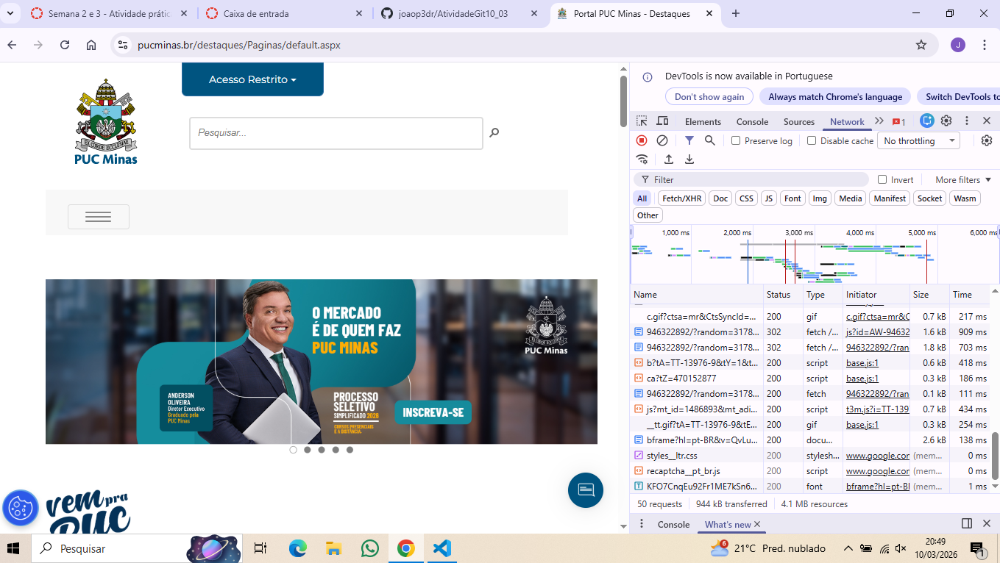
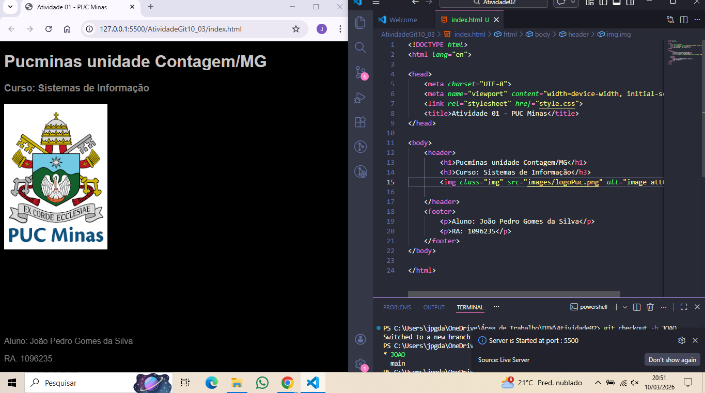

# AtividadeGit10_03
Atividade pratica de git para o professor Fábio. 

Nome Aluno: João Pedro Gomes da Silva

Print da tela com os testes de inspeção de conexão feitos com o navegador:

Print do resultado apresentado no navegador para o arquivo index.html:

ADICIONANDO ESSA FRASE NO README PARA PODER FAZER O MERGE
